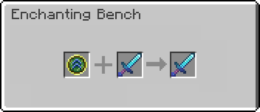
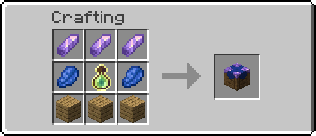

# Enchanting Bench

Datapack by Moxvallix, with help from Wulfian

## Requirements
Enchanting Bench requires Minecraft 1.21.4.

It relies on the [Smithed Custom Block API v0.2.0](https://docs.smithed.dev/libraries/custom-block/), which will need to be installed.

## Overview
Enchanting Bench aims to help with some of the pains of the vanilla enchanting system. It provides a means of upgrading enchantments on items, without having to combine the item with a book. As well, it allows you to reset the anvil cost of an item, such that you can continue to upgrade the item without having to worry about a particular order.

### Items
#### Enchanting Bench
The Enchanting Bench is a custom block that is used to apply orbs to equipment. It features a similar UI to an Anvil.

The crafting recipe for an Enchanting Bench is fairly affordable, requiring amethyst, lapis, planks, and a bottle of enchanting.

#### Orb of Enhancement
The Orb of Enhancement will upgrade the level of a random enchantment on a piece of equipment. Doing so will cost experience levels the same as in an anvil. Upgrading an enchantment will also increase the anvil cost, meaning each subsequent upgrade will cost more experience.

The crafting recipe for orbs is fairly pricey, but fair given what they can do. It requires diamonds, bottles of enchanting, and lapis.

#### Orb of Potential
The Orb of Potential will reset the anvil cost of any item. Doing so will cost experience levels equivalent to the anvil cost.

The crafting recipe requires diamonds, bottles of enchanting, and amethyst.

## License
Enchanting Bench is free/open source software, licensed as GPL3.0 or later. This means you can do whatever you like with the pack, as long as your changes are also released as GPL. See [LICENSE.md](LICENSE.md) for full license text.